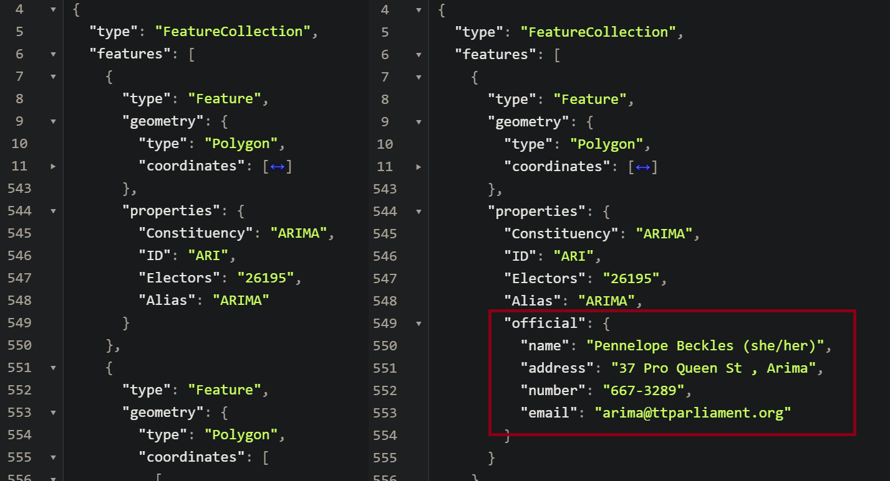

# GeoJSON - Trinidad and Tobago Member of Parliament Web Scraper & Baker
Welcome to the GeoJSON baker for TTMP information! This project was designed to "bake"/embed information regarding the general election members of parliament. As future elections occur, there is a need to produce this GeoJSON file with all of the information included. Initially designed as a utility tool for [SpotDPothole Frontend](https://github.com/Boldoosang/NAV-spotDPothole-frontend).


## IMPLEMENTED FEATURES
The following features have been implemented:
* Automatic downloading of general election map.
* Automatic gathering of general election constituency leaders.
* Automatic baking of constituency leaders into election map.
* Can be configured as a script, module, or executed via the command line.


## CONFIGURATION AS A SCRIPT
The application can be initialized and configured as a script as follows:
(Optional) Create a virtual environment for the project and activate it.
```
$ python -m venv "venv"
$ venv/Scripts/Activate.bat
```
Install the requirements for the application using pip3.
```
$ pip install -r requirements.txt
```
Place your input GeoJSON file into the directory and rename it to "mapIn.geojson" OR edit the constructor within main.py to include the URL to the geojson file using the optional 'geojson_url' argument.
Run the baker using the following command:
```
$ python main.py
```
Make use of your new baked GeoJSON file, "mapOut.geojson"!

## CONFIGURATION AS A MODULE
The application can be initialized and configured as a module for an existing project as follows:
Install the requirements for the application using pip3.
```
$ pip install -r requirements.txt
```
Place your input GeoJSON file into the directory and rename it to "mapIn.geojson" OR edit the constructor within main.py to include the URL to the geojson file using the optional 'geojson_url' argument.
Import and configure the wsbaker as follows:
```
#Step 1: Import
from wsbaker import wsbaker

#Step 2: Configure using wsbaker(inputFileLocation.geojson, outputFileLocation.geojson, scrape_url, *geojson_url)
#GeoJSON data stored as JSON data can also be entered.
wb = wsbaker("input.geojson", "output.geojson", "https://scrapablewebsite.com", "https://ebctt.com/pathtomap.json")

#Step 3: Run
wb.run()
```
Make use of your new baked GeoJSON file, "mapOut.geojson"!

## CONFIGURATION VIA COMMAND LINE
The application can be initialized and configured via the command line as follows:
Navigate to the directory of the project.
Open a terminal within the same directory and install the requirements for the application using pip3.
```
$ pip install -r requirements.txt
```
Place your input GeoJSON file into the directory and rename it to "mapIn.geojson"

Using a terminal within the project directory, run the following command customized for your project:
```
#For an already downloaded GeoJSON file and using the default/tested scrapable website:
$ py wsbaker "input.geojson" "output.geojson" 
#For a JSON file that is located on a website:
$ py wsbaker "input.geojson" "output.geojson" --url "https://website.com/electiondata.html"
#For another endpoint that can be used to scrape the data. This WILL require modification to the scraper function of the wsbaker class.
$ py wsbaker "input.geojson" "output.geojson" --url "https://website.com/electiondata.html" --json "https://ebctt.com/pathtomap.json"
```
Make use of your new baked GeoJSON file, "output.geojson"!

## THE RESULTS
The following show the differences in the stucture of the GeoJSON file to reflect the addition of the MP information.



## DEPENDENCIES AND FRAMEWORKS
* [Python 3.12](https://www.python.org/downloads/) - Python as main programming language.
* [EBC Constituency Map Overlay](https://ebctt.com/constituencies.json) - Used as the GeoJSON file for elections.
* [Selenium Web Driver](https://www.selenium.dev/documentation/webdriver/) - Selenium used for web-browser automating.
* [Picong Party Election](https://www.thepicongparty.com/politics/profiles/central) - Picong Party for MP Data.